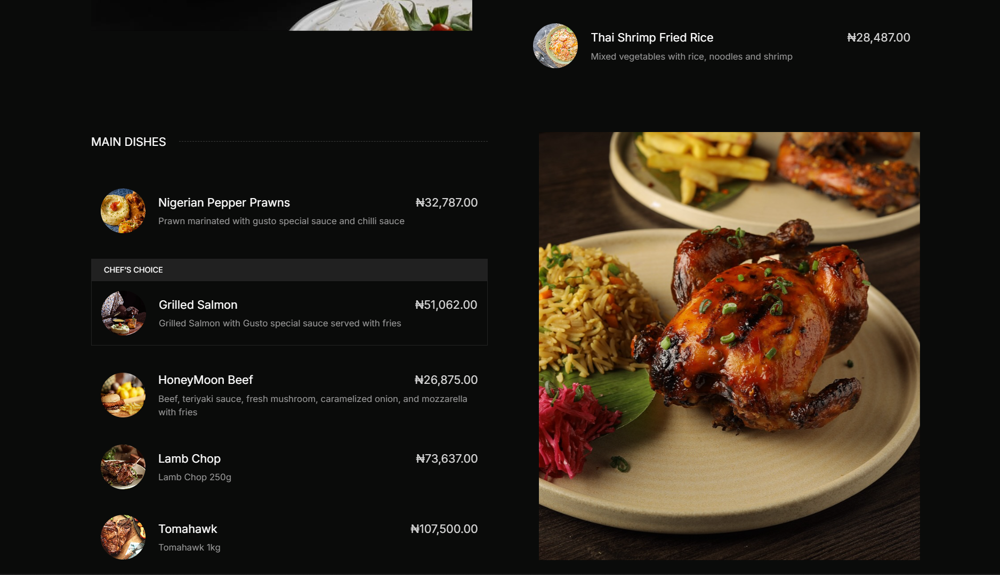

# 🍽️ Gusto Restaurant Website  

> A modern, elegant restaurant website built to showcase fine dining at its best.  

🌐 **Live Demo:** [https://gusto-restaurant-one.vercel.app/](https://gusto-restaurant-one.vercel.app/)

---

## 📖 Table of Contents  
- [Overview](#overview)  
- [Features](#features)  
- [Technologies Used](#technologies-used)  
- [Installation & Setup](#installation--setup)  
- [Project Structure](#project-structure)  
- [Usage](#usage)  
- [Customization & Deployment](#customization--deployment)  
- [Contribution](#contribution)  
- [License](#license)  

---

## 🧠 Overview  
**Gusto Restaurant** is a sleek and fully responsive restaurant website designed to provide visitors with an immersive experience. It highlights the restaurant’s **menu**, **gallery**, **reservations**, and **contact** sections — all wrapped in a clean, modern design suitable for high-end dining.

## 🖼️ Preview  

Here’s a quick look at the **Gusto Restaurant Website**:

### 🏠 Homepage


### 🍽️ Menu Section


### 📅 Reservation Section


---

## ✨ Features  
- 📱 Fully responsive across all devices  
- 🍽 Detailed menu with categories and prices  
- 🖼 Elegant image gallery showcasing dishes and ambiance  
- 📝 Table reservation form  
- 📍 Contact section with map, phone, and social links  
- ⚡ Smooth animations and transitions  
- 🚀 Deployed and live on [Vercel](https://vercel.com)

---

## 🛠 Technologies Used  
- **HTML5** – semantic structure  
- **CSS3** – layout and styling  
- **JavaScript (ES6+)** – interactivity  
- *(Optional: add frameworks like Tailwind, Bootstrap, or Next.js if used)*  
- **Vercel** – deployment and hosting  

---

## 💻 Installation & Setup  

To run the project locally:

```bash
# Clone the repository
git clone https://github.com/your-username/gusto-restaurant.git

# Navigate into the folder
cd gusto-restaurant

# If using a build system (optional)
npm install
npm run dev
